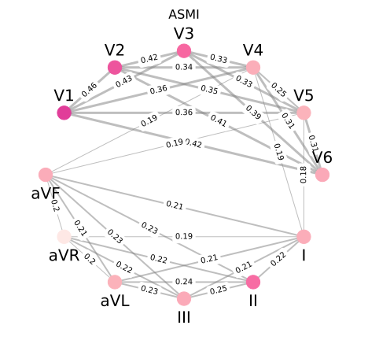
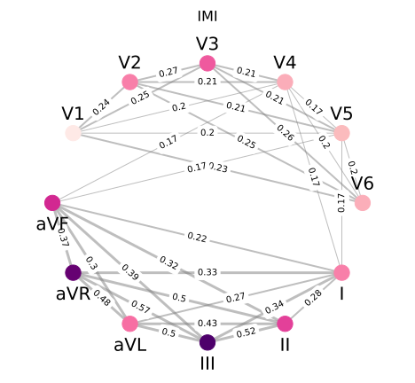
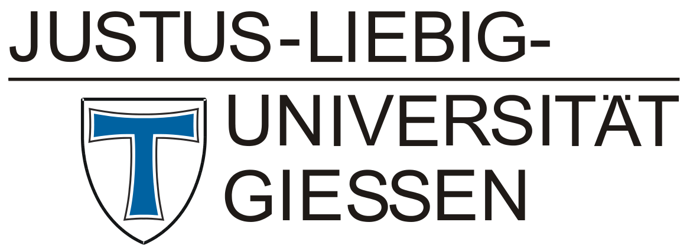

# xGNN4MI: Explainability of Graph Neural Networks in 12-lead Electrocardiography for Cardiovascular Disease Classification

## Abstract
The clinical deployment of artificial intelligence (AI) solutions for assessing cardiovascular disease (CVD) risk in 12-lead electrocardiography (ECG) is hindered by limitations in interpretability and explainability. To address this, we present xGNN4MI, an open-source framework for graph neural networks (GNNs) in ECG modeling for interpretable CVD prediction. Our framework facilitates modeling clinically relevant spatial relationships between ECG leads and their temporal dynamics. We also developed specific explainable AI (XAI) and visualization tools to identify ECG leads crucial to the model's decision-making process, enabling a systematic comparison with established clinical knowledge. We evaluated xGNN4MI on two challenging tasks: diagnostic superclass classification and localization of myocardial infarction. Our findings show that the interpretable ECG-GNN models demonstrate good performance across the tasks. XAI analysis revealed clinically meaningful training effects, such as differentiating between anteroseptal and inferior myocardial infarction. Our work demonstrates the potential of ECG-GNNs for providing trustworthy and interpretable AI-based CVD diagnosis.

## Results
<table>
  <tr>
    <td align="center">
      <br/>
      <sub><b>Figure 1:</b> Color-coded mean node and edge importance scores for correctly classified ASMI patients on the PRB-XL dataset.</sub>
    </td>
    <td align="center">
      <br/>
      <sub><b>Figure 2:</b> Color-coded mean node and edge importance scores for correctly classified IMI patients on the PRB-XL dataset.</sub>
    </td>
  </tr>
</table>

## Datasets
### PTB-XL
PTB-XL is a publicly available ECG dataset consisting of 21799 clinical 12-lead ECGs from $18869$ patients, each 10s in length.
https://doi.org/10.1038/s41597-020-0495-6

### SHIP
The data of the SHIP study cannot be made publicly available due to the informed consent of the study participants, but it can be accessed through a data application form available at https://fvcm.med.uni-greifswald.de/ for researchers who meet the criteria for access to confidential data.

## License
This work is licensed under a CC BY-NC 4.0 License 


## Reference
If you find our work useful in your research or use parts of this code please consider citing our paper:
```
@misc{maurer_xgnn4mi_2025,
	title = {{xGNN4MI}: {Explainability} of {Graph} {Neural} {Networks} in 12-lead {Electrocardiography} for {Cardiovascular} {Disease} {Classification}},
	url = {https://www.researchsquare.com/article/rs-7721630/v1},
	doi = {10.21203/rs.3.rs-7721630/v1},
	publisher = {In Review},
	author = {Maurer, Miriam Cindy and Hempel, Philip and Steinhaus, Kristin Elisabeth and Chereda, Hryhorii and Vollmer, Marcus and Krefting, Dagmar and Spicher, Nicolai and Hauschild, Anne-Christin},
	year = {2025},
}
```

## Copyright

<p style="margin-left:40px;">
  
  &nbsp;&nbsp;&nbsp;&nbsp;&nbsp;&nbsp;&nbsp;&nbsp;&nbsp;&nbsp;
  &nbsp;&nbsp;&nbsp;&nbsp;&nbsp;&nbsp;&nbsp;&nbsp;&nbsp;&nbsp;
  &nbsp;&nbsp;&nbsp;&nbsp;&nbsp;&nbsp;&nbsp;&nbsp;&nbsp;&nbsp;
  &nbsp;&nbsp;&nbsp;&nbsp;&nbsp;&nbsp;&nbsp;&nbsp;
  
</p>

<p style="margin-left:40px;">
  
  &nbsp;&nbsp;&nbsp;&nbsp;&nbsp;&nbsp;&nbsp;&nbsp;&nbsp;&nbsp;
  &nbsp;&nbsp;&nbsp;&nbsp;&nbsp;&nbsp;&nbsp;&nbsp;&nbsp;&nbsp;
  
</p>


## Acknowledgement
We gratefully acknowledge the computing time granted by the Resource Allocation Board and provided on the supercomputer Emmy at NHR@Göttingen as part of the NHR infrastructure, under the project nib00044. 
This work is supported in part by the German Ministry of Education and Research (BMBF) under grant agreement no. 01KD2208A and no. 01KD2414A (FAIrPaCT), by the Innovation Committee at the Federal Joint Committee no. 01VSF20014 (KI-Thrust) and by the Lower Saxony “Vorab” of the Volkswagen Foundation and the Ministry for Science and Culture of Lower Saxony, grant no. 76211-12-1/21. 
SHIP is part of the Community Medicine Research net of the University of Greifswald, Germany, which is funded by the Federal Ministry of Education and Research (grants no. 01ZZ9603, 01ZZ0103, and 01ZZ0403), the Ministry of Cultural Affairs as well as the Social Ministry of the Federal State of Mecklenburg-Western Pomerania, and the network "Greifswald Approach to Individualized Medicine (GANI_MED)" funded by the Federal Ministry of Education and Research (grant no. 03IS2061A).
